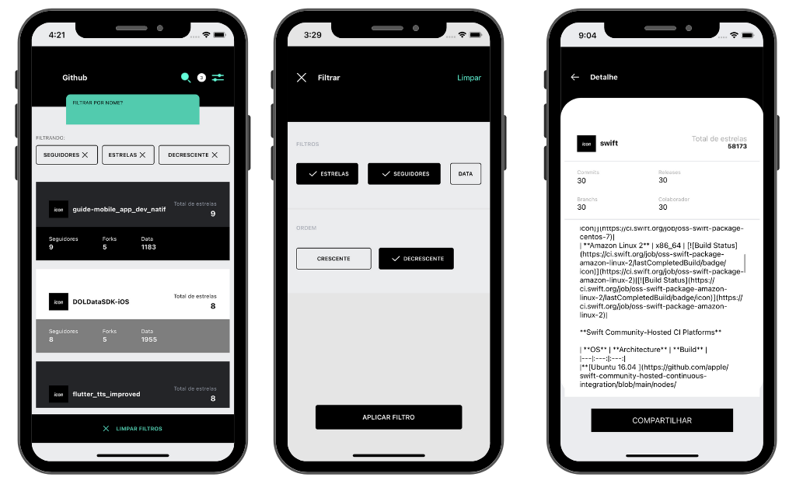

<h1 align="center">Desafio iOS Modal 🍎</h1>

  > O nosso objetivo foi construir uma aplicação iOS usando Swift para consumir a API do GitHub seguindo o escopo do desafio do Banco Modal.

## Escopo do Projeto 🖥️
-   View da Home 🆗
-   View de Filtro 🆗
-   View de Detalhes 🆗
-   Fazer uma busca por nome do repositório 🆗  
-   Criar um filtro por estrelas, seguidores e data do último commit❗
> O filtro por estrela funciona corretamente. Entretanto, não encontramos um endpoint que retorna os dados ordenados por seguidores ou pela data do último commit, então optamos por receber um array e ordernar conforme a necessidade.
-   Mostrar ícone e informações básicas do repo 🆗
-   Paginação com rolagem infinita 🆗
-   Puxe para atualizar a lista de repositórios 🆗
-  Autenticação da API do GitHub❗
> Utilizamos um token

## Telas  🏠🔖🔍

## Autores 🚀

👨‍🚀 [Aryel Santos](https://github.com/aryelsander)     👨‍🚀 [Victor Magdesian](https://github.com/victormagdesian)     👨‍🚀 [Victor Moura](https://github.com/vitutiv)     👨‍🚀 [Gabriel Matheus](https://github.com/gabrielrom)     👨‍🚀 [Pedro Castro](https://github.com/pedrogaldiano)

## Requisitos 🧾

- Higher Order Functions;
- Autolayout;
- MVVM-C;
- Xib - Não use Storyboard ou ViewCode;
- Xcode 13.1+;
- iOS 13.0+;
- Swift 5+;
- Swiftlint;
- SPM;
- RxSwift – Única framework a ser adicionada no projeto;

## Plus ➕

- Unit/UI Tests XCTests;
- Componentes customizados;
- Fonte customizadas;
- l10n;

## PlusPlus ➕➕

- Faça tudo usando SwiftUI com Combine.

## Entrega e Prazo 📅

Você tem uma semana para terminar o teste e enviar o link do teste publicado no Github.
